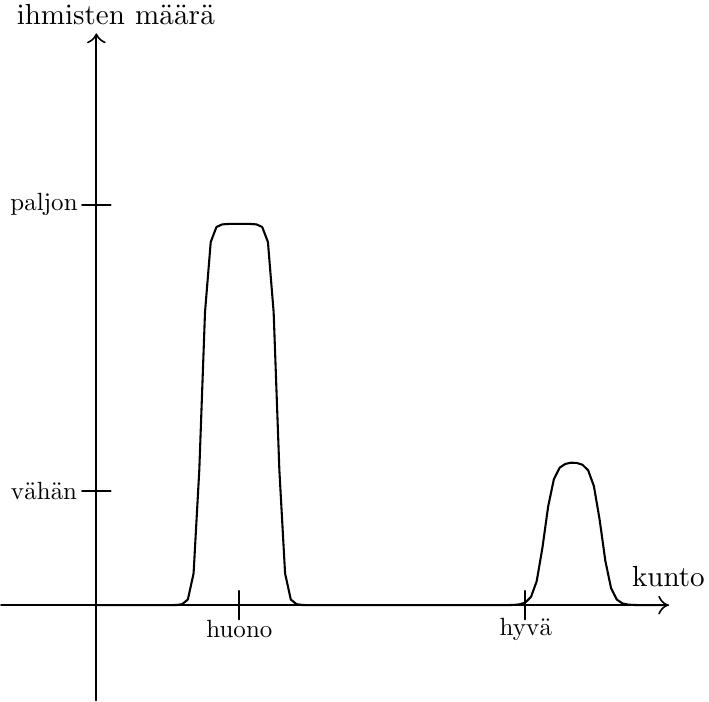
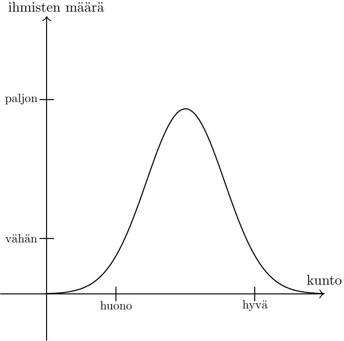

# Binääriset kategoriat ja jakaumat

Kerran kuulin jonkun sanovan "Nykyään ihmisillä on huono kunto, paitsi ne, joilla on hyvä kunto, ovat *tosi* hyvässä kunnossa".

Pysähdyin miettimään. Kuva, jonka kommentti maalaa, näyttää tällaiselta:

Hmm, erikoista. Nimittäin yleensä kun olen nähnyt oikeaan dataan perustuvia jakaumia, niin ne ovat pikemminkin tämänmuotoisia:

Binäärinen jaottelu ei ole oikea näkökulma aiheeseen. Vasta kun karkea kuva jatkuvasta jakaumasta on kunnossa, voidaan lähteä esittämään väitteitä kuten "ihmisten kunto on keskimäärin heikentynyt" tai "hyväkuntoisimman 1% ihmisistä kunto on noussut".

"Tietysti tämä on se, mitä väitteen esittäjä tarkoitti. Tietenkään hän ei oikeasti tarkoittanut, että on ne huonokuntoiset ihmiset ja sitten ne hyväkuntoiset ihmiset", kuuluu vastalause. Pidän tätä [liian kohteliaana tulkintana](/epi/kohteliaat_tulkinnat) väitteelle. Ihmiset eivät automaattisesti mieti asioita jakaumina.

Miksi uskon näin? Joitain syitä:

- Omien ajatusten (ja muiden ihmisten puheiden) reflektointi paljastaa, että käytännössä tulee liian usein mietittyä asioita binääristen kategorioiden kautta.
- Jakaumien käsittely on opittu taito, ei jotakin, mikä ihmisillä on luonnostaan tai minkä evoluutio on meihin rakentanut. Ihmiskunnalla ei ole aina ollut tilastotieteen oppeja, vaan ne on jouduttu kehittämään.
- Minulle tulee mieleen muutama [tunnettu](https://en.wikipedia.org/wiki/Insensitivity_to_sample_size) "[paradoksi](https://en.wikipedia.org/wiki/Berkson%27s_paradox)" tai [ajatusvirhe](https://en.wikipedia.org/wiki/Neglect_of_probability) tilastoihin liittyen.

Jos lähden miettimään, mistä binäärisiin kategorioihin ja jakaumiin liittyvät virheet johtuvat, niin keksin pari selitystä:

Ensinnäkin jakaumia on kognitiivisesti työläämpää käsitellä. On niin helppoa ajatella, että on ne hyväkuntoiset ihmiset ja sitten on ne huonokuntoiset ihmiset. Vastaavasti on helppoa miettiä parhaimpia ja huonoimpia -- ne [tulevat helpoiten mieleen](https://en.wikipedia.org/wiki/Availability_heuristic). Keskiarvojen, varianssin ja jakaumien muodon käsittely on haastavampaa.

Toiseksi saamassamme informaatiossa on vahvaa suodatusta: kuulemme paljon todennäköisemmin todella hyväkuntoisista kuin keskiverrommista ihmisistä (puhuttaessa kunnosta) verrattuna heidän määrään. Kilpailuissa etsitään parhaita ja heistä on kiinnostavampaa puhua. Seuraus: on ne hyväkuntoiset ihmiset joista aina puhutaan, ja sitten on me tavalliset tallaajat. Muistimme, ihmisten puheiden ja median tarjoama data ei ole *representatiivista*.

Pyrin itse olemaan yksi heistä, jotka käyttävät jakaumia sopivasti.
