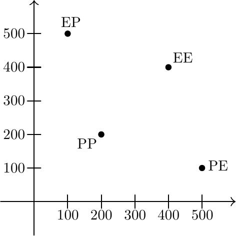
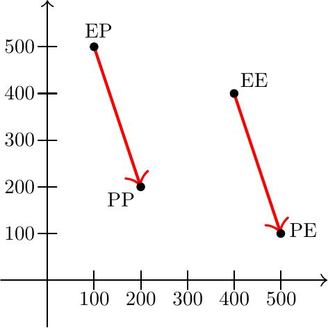
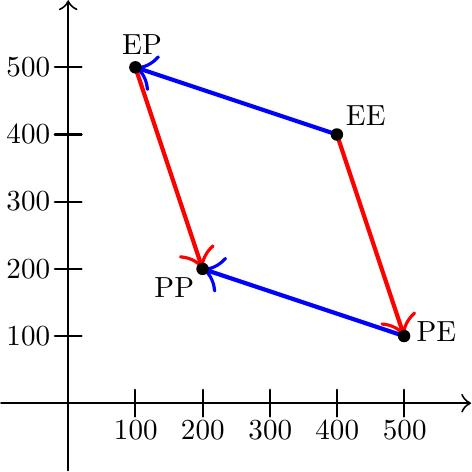
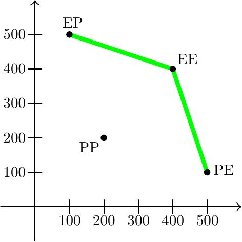

# Insentiivit, koordinaatio ja Pareto-käyrä

Palkinnot ja rangaistukset vaikuttavat ihmisten toimintaan. Viittaan näihin laajassa merkityksessä: en vain palkkaan ja vankeustuomioihin, vaan myös arvosanoihin, arvostukseen, negatiivisiin kommentteihin, muiden hyväksyntään ja paheksuviin katseisiin.

"Järjestin illanvieton kavereideni kanssa.  Ihmiset vaikuttivat pitävän siitä: sain paljon positiivista palautetta! Saatan järjestää tällaista jatkossakin" vs. "Järjestin illanvieton kavereideni kanssa. En oikein tiedä, mitä ihmiset pitivät siitä, ja joku valitti kuinka se oli liian myöhään ja olisi siksi tarvinnut ruokaa. En viitsi enää järjestää tällaisia."

"Olen vähän kahden vaiheilla, haluanko jatkaa opiskelua. Toisaalta haluaisin tehdä muita juttuja, mutta toisaalta sitten muut ihmiset kyseenalaistavat valintojani. Opiskelujen jatkaminen on turvallisempi vaihtoehto."

"Kyllä tenteissä nytkin pystyy huijaamaan, mutta jos valvontaa vähennettäisiin, olisi huijaaminen helpompaa ja vähemmän riskialtista, jolloin houkutus olisi suurempi."

"Kävin tuossa ravintolassa kerran syömässä. Ruoka oli hyvää, mutta työntekijät käyttäytyivät ikävästi, niin minun ei tee mieli käydä siellä uudestaan."

*Insentiivillä* viitataan laajasti tekijöihin, jotka työntävät ihmisiä toimimaan tietyllä tavalla. Palkinnot ja rangaistukset ovat selkeitä esimerkkejä. On myös muita, jotka eivät sovi näihin kategorioihin edes löysästi tulkittuna.

"Aioin soittaa heidän asiakaspalveluunsa, mutta se oli todella vaikeaa: puhelinnumeroa sai etsimällä etsiä ja sitten jouduin jonon perään. Annoin asian olla. Ihan kuin se olisi tehty tarkoituksella vaivalloiseksi!"

"Lentäessä on ikävää, kun turvatarkastuksissa on niin pitkät jonot. Matkustaisin enemmän, jos jonottamiseen menisi vähemmän aikaa."

Insentiivit ovat kuin fysikaaliset voimat, mutta ihmisille ja ihmisjoukoille: ne työntävät tiettyyn suuntaan, toimimaan tietyllä tavalla.

---

Ensimmäinen iso väitteeni on: insentiivit todella vaikuttavat ihmisten käytökseen. Nämä eivät ole pikkujuttuja. Insentiivejä muuttamalla ihmisten toiminta muuttuu.

Määrittelin insentiivin viittaamaan "tekijöihin, jotka työntävät ihmisiä toimimaan tietyllä tavalla", jolloin pointti voi tuntua triviaalilta. Kyseessä ei kuitenkaan ole mikään sanaleikki. Tarkoitan, että asiat, jotka *tavallisesti mielletään insentiiveiksi*, vaikuttavat ihmisten käytökseen.

Vastakkainen näkökulma voisi olla, että ei tällaisilla pienillä tekijöillä ole niin väliä. Ihmiset lentävät silloin, kun on tarvetta, ei turvatarkastuksen jonojen perusteella.

Pidän tätä virheellisenä näkemyksenä. Oma näkemykseni on: Asiaa ei tule miettiä näin binäärisesti vaan [jakaumien kautta](https://ollij.fi/epi/binaarinen_jakauma). Ihmiset matkustelevat ([hyvin](https://ollij.fi/epi/leveat_jakaumat)) erinäisistä syistä. Jonotus vaikuttaa ihmisten tunteisiin ja mielleyhtymiin koskien lentämistä. Pienet tekijät työntävät jotkut ihmiset joissakin tilanteissa kriittisen rajan yli, jolloin he eivät matkustakaan. Isolta osin tämä ei ole tietoista ja syytä "lentäessä pitää jonottaa paljon" ei välttämättä osattaisi sanoa eksplisiittisesti.

---

Toinen iso väitteeni on: insentiivit auttavat ymmärtämään ihmisten ja ihmisjoukkojen käytöstä.

Esimerkki: Yksinkertainen lapselle kerrottava kuvaus koulusta on "koulussa tavoitteena on oppiminen". Tämä malli on mielestäni hieman, no, yksinkertainen. Esimerkiksi yliopistossa yksi tavoite tavallaan on, että opiskelijat oppivat (siksihän yliopistoa käydään, eikö). Miten käy käytännössä?

Jos ollaan rehellisiä, niin monella iso osa opiskelun tavoitteita on tutkinnon saaminen. Tämä *tavallaan* kyllä liittyy oppimiseen: tutkinto vaatii kurssien suorittamista, kurssien suorittaminen vaatii kokeen tekemistä (tai muuta vastaavaa), kokeesta läpipääsy vaatii oppimista tai osaamista. Toisaalta taas on monia tapoja edistää tutkinnon saamista *ilman*, että tämä niin edistää oppimista: Valitaan helpoimmat ja vähiten työtä vaativat kurssit (eikä niitä, joista oppisi eniten). Tehdään vain pakolliset asiat ja vain sillä tasolla, että ne hyväksytään (eikä niin, että tehtävät olisivat kehittäviä). Yritetään päästä kokeesta läpi rimaa hipoen edellisen päivän lukemisella (ja viikon tai vuoden päästä kaikki on unohdettu). Puhumattakaan vähemmän ja enemmän epärehellisistä keinoista.

Tällaista toimintaa on vaikea käsittää "kouluun mennään oppimaan" -näkökulmasta, mutta se selittyy helposti seuraamalla insentiivejä: palkintonahan on työnhaussa hyödyllinen tutkinto.

Insentiivit vaikuttavat tietysti myös muihin kuin opiskelijoihin. Yliopistojen rahoituksesta iso osa perustuu tutkintoihin: [vuodesta 2021 alkaen](https://okm.fi/documents/1410845/4392480/Rahoitusmalli+Yliopistot.pdf/3464a1bc-3272-f5db-7361-acdcb498c661/Rahoitusmalli+Yliopistot.pdf) 42% yliopistojen rahoituksesta kohdistuu koulutukseen, mistä 71% määräytyy suoritettujen tutkintojen perusteella. (Vertailun vuoksi: "jatkuvaan oppimiseen" perustuu 12 prosenttia). Tämän näkökulman kautta esimerkiksi anekdootit, joissa opiskelijat saavat kurssisuorituksia... sanotaanko *heikoilla* näytöillä varsinaisesta osaamisesta tai oppimisesta, ovat vähemmän yllättäviä.

---

Kolmas iso väite: insentiivit auttavat ymmärtämään, miksi ihmiset tekevät "pahoja" asioita.

Kuten jo sanoin, insentiivit vaikuttavat ihmisten käytökseen ja insentiivejä muuttamalla ihmisten toiminta todella muuttuu. Jos insentiivit sattuvat osoittamaan suuntaan "tee pahoja asioita", niin...

On joitakin toimialoja, yrityksiä ja työntekijöitä, joiden vaikutus maailmaan yleisesti on mielestäni negatiivinen. Valitsen esimerkikseni tupakan: olisi parempi, jos tupakkaa markkinoitaisiin, tuotettaisiin ja kulutettaisiin vähemmän.

Tarkoittaako tämä, että pidän tupakan parissa työskeneteleviä ihmisiä "pahoina"? Ei!

Myönnän, etten tiedä paljoa siitä, millaisia nämä ihmiset ovat ja millaisissa olosuhteissa he ovat. (Heitä myös on monenlaisia: tupakkateollisuuden parissa työskentelee noin *sata miljoonaa* ihmistä. [Siitäkin huolimatta, etten itse tunne ketään tällaista](https://ollij.fi/epi/leveat_jakaumat).) Voin kuitenkin hyvin kuvitella, että joillakin yksinkertaisesti ei ole parempia vaihtoehtoja. Jos vaihtoehtoina on tehdä töitä kasvattamalla tupakkaa tai... olla tekemättä näin ja olla saamatta elantoa, niin en todellakaan kutsuisi henkilöä "pahaksi", jos hän valitsee ensimmäisen. Insentiivit osoittavat vahvasti sen suuntaan.

(Asiaan liittyy muutkin tekijät, kuten eriävä informaatio: en usko, että [kaikki tietävät](https://ollij.fi/epi/jattilaisten_olkapailla) tupakan olevan pahaksi.)

Pystyn siis ymmärtämään, tietämättömyydeni vuoksi hyvin hatarasti mutta kuitenkin, että joillakin on hyvät syyt toimia miten he toimivat.

Tuon tämän esille siksi, että ihmisten oletusasetus tuntuu olevan "ongelmat ovat pahojen ihmisten syytä". Esimerkkiä tupakasta kirjoittaessani ajattelin kuvitteellisen lukijan miettivän "no mutta kyllä niitä pahojakin ihmisiä on". En ole sinänsä eri mieltä: jakaumat ovat leveitä, jotkut ihmiset todella ovat pahempia kuin toiset. Silti näihin ["pahoihin ihmisiin" keskitytään liikaa](https://ollij.fi/epi/helpot_maalitaulut). Se ei ole keskeisin syy sille, miksi asiat ovat huonosti. Yleisempiä syitä ovat huonot insentiivit, kun huono vaihtoehto on silti paras mitä on (itselle vaikkei laajemmin), kun ihmiset eivät tiedä tekojensa seurauksia, kun asiat ovat vaikeita.

(Käytännössä ihmiset harvemmin käyttävät sanaa "paha". Itse kuulen enemmän sanoja "rikas" tai valtaapitävät" tai "poliitikko" tai "fiksu" tai vastaavaa niin, että kontekstista ymmärtää näiden olevan negatiivisesti latautuneita sanoja pitkälti ajaen samaa roolia kuin "paha".)

---

Neljäs iso, ja kenties isoin, väitteeni: insentiivit auttavat ymmärtämään, mikseivät asiat ole paremmin.

Sitä joskus tulee mietittyä "miksi tuo asia on huonosti?" tai, vähemmän hienovaraisesti, "miksi kaikki on niin huonosti?"

Helppo ja usein esitetty vastaus kuuluu "ihmiset ovat tyhmiä". Ja tämän vastauksen kuultuani... en ymmärrä asioita yhtään sen paremmin. Eikä ihme: "ihmiset ovat tyhmiä" tuntuu vain tarkoittavan "ihmiset tekevät asioita huonosti", mutta kysymys oli *miksi* näin on. Yleispätevä vastaus on vähän kuin yleispätevä vasta-argumentti: hyödytön. Tai, pahempaa, se *vaikuttaa* hyvältä vastaukselta, se saa *uskomaan* että ymmärtää asioita paremmin, vaikkei näin ole -- jolloin omat uskomukset ovat *vähemmän* totuudenmukaisia kuin aiemmin. (Ja ongelma on tietysti vain *muiden* ihmisten tyhmyydessä...)

Kyllä, kiitos, ihmiset ovat tyhmiä, mutta miten asiat olisivat *eri tavalla*, jos ihmiset olisivat vähemmän tyhmiä? (Ei, "paremmin" ei ole vastaus.) Voitaisiinko me silti tehdä asioita noin, vaikka ihmiset ovatkin "tyhmiä"? Ja *millä tavoilla* ja *mistä syistä* ihmiset ovat tyhmiä? Voitaisiinko noille tehdä jotakin?

Riman ollessa näin matalalla on helpompi keksiä parempia vastauksia. Insentiivit vaikuttavat yhdeltä oleelliselta palapelin palalta, joka selittää epätäydellisyyksiä. Ihmisiä työntävät voimat eivät (aina) osoita kohti Hyviä Asioita. Välillä ne osoittavat kohti Huonoja Asioita. Ihmiset (välillä) seuraavat insentiivejä. Sitten tapahtuu Huonoja Asioita. Tai välillä sopivat insentiivit kohti Hyviä Asioita puuttuvat ja kukaan ei tee niitä.

---

Muinaisen perinteen mukaan missä tahansa peliteoriaa käsittelevässä tekstissä tulee mainita [vangin dilemma](https://plato.stanford.edu/entries/prisoner-dilemma/). Käytän seuraavaa muotoilua:

"Sinut on valittu yhdeksi pelaajaksi erääseen kahden pelaajan peliin. Molemmilla pelaajilla on alussa 400 euron potti. Pelissä kummallakin pelaajalla on mahdollisuus painaa, toiselta salassa, nappia. Napin painaminen antaa painajalle 100 euroa, mutta vähentää toisen pottia 300 eurolla. Et pelin jälkeen enää koskaan tapaa toista osapuolta. Painatko nappia?"

Kuva tilanteesta, jossa x-koordinaatti kuvaa omaa rahasummaa, y-koordinaatti toisen ja jossa esimerkiksi lyhenne "PE" tarkoittaa "minä painan, toinen ei":

Omat insentiivit ovat ilmiantamisen puolella: riippumatta siitä, mitä toinen tekee, on sinun parempi painaa nappia. Painaminen (kuvassa nuolen seuraaminen) antaa sinulle 100 euroa enemmän rahaa.

Mitä käy, jos molemmat ajattelevat näin? Seuraa nuolia.

Insentiivit työntävät osapuolia, kunnes päädytään "kuoppaan", "stabiiliin pisteeseen", jossa molemmat painavat nappia. (Tekninen muotoilu: tämä on pelin ainoa Nashin tasapaino.)

Mikä on ongelma? *Kumpikin* teistä preferoi tilaa EE tilan PP sijasta: tällöin molemmat saavat 400 euroa verrattuna 200 euroon. Sanotaan, että (ei, ei) on *Pareto-parannus* (paina, paina)-tilaan nähden. Insentiivejä seuraamalla kuitenkin päädytään tilanteeseen, johon *kumpikaan* ei ole tyytyväinen. On vaihtoehto, joka on *molemmille* teistä mieluisampi.

Yleisesti *kaikki* osapuolet haluavat toteuttaa Pareto-parannuksen, jos niitä suinkin on olemassa. *Pareto-käyräksi* kutsutaan tiloja, joille ei enää ole olemassa Pareto-parannusta. *Kaikki* haluavat Pareto-käyrälle tai lähemmäs sitä (kyse on vain *mihin kohtaan* Pareto-käyrällä tähdätään).

Silti aina sinne ei päästä. Insentiivit voivat välillä olla sellaisia, joita seuraamalla päädytään stabiiliin mutta huonoon tilaan. Ihmiset tekevät (naiivisti ajateltuna) itselleen parhaan asian ja tämän seurauksena kollektiivisesti pudotaan Pareto-käyrältä. (Ehkä se ei ollutkaan itselle paras asia...)

Onneksi tämä on vain ajatusleikki. Oikeassa elämässä ihmisillä ei tietenkään ole eriäviä preferenssejä (tai eriäviä *uskomuksia*), insentiivit osoittavat aina kohti yhteistä hyvää ja yksittäiselle henkilölle paras vaihtoehto on tietysti aina muillekin paras.

---

Joskus huvitan itseäni ajatuksella, että emme ole Pareto-käyrällä vain sen takia, etteivät ihmiset omaa Pareto-käyrän konseptia ([kunnes sysään ajatuksen mielestäni](https://ollij.fi/epi/yksi_muuttuja)).

Ongelma on toki syvemmällä. Ihmisten käsitys *optimaalisesta toiminnasta* ja *rationaalisesta ihmisestä* on sellainen, joka johtaa huonoihin lopputuloksiin. Olen [aiemminkin](https://ollij.fi/epi/filosofiatila) puhunut siitä, kuinka ihmisten konsepti "rationaalisuudesta" sisältää kaikenlaista hölynpölyä, kuten "rationaalinen ihminen on täysin itsekäs". Ja itsekkyyshän tietysti tarkoittaa, että vangin dilemman kaltaisissa koordinaatio-ongelmissa ei tehdä yhteistyötä muiden kanssa.

Ja koko vangin dilemman pointti, yksi *koko peliteorian* keskeisimmistä pointeista, on mennyt ohi. Jos kerta olet niin rationaalinen, niin mikset saa, mitä haluat? Jos kerta olette niin rationaalisia, niin miksette ole Pareto-käyrällä? Yritän olla juuttumatta sanojen määritelmien käsittelyyn, mutta minulla on ehdotus: jospa vaikka konseptisi rationaalisuudesta vastaisi sitä, millä oikeasti saavutetaan parhaat lopputulokset.

(Hyökkään tietysti olkiukkoa vastaan, eikö? [Wikipedia-sivulla vangin dilemmasta](https://en.wikipedia.org/wiki/Prisoner%27s_dilemma) kirjoitetaan "Loyalty to one's partner is, in this game, irrational" -- ja ei, kyse ei ole vain tästä Wikipedia-sivusta. Siten pitää keksiä uusia sanoja kuten "[superrationaalinen](https://en.wikipedia.org/wiki/Superrationality)" sille, mikä on *oikeasti* hyvä tapa toimia. Tai hetkinen, tässä superrationaalisuudessakin on ongelmansa, ja paras toimintatapa onkin se joka on *hyperrationaalinen*...)

Tämä on yksi helposti artikuloitava tekijä sille, mikemme elä [täydellisessä maailmassa](https://ollij.fi/epi/tehokas_maailma). Ihmisillä ei ole konseptia Pareto-parannuksesta tai Pareto-käyrästä. Ihmiset eivät toimi tavalla, jonka seurauksena päädytään lähellekään Pareto-käyrää. Ihmisten käsitys optimaalisesta, rationaalisesta toiminnasta on sellainen, joka ei johda Pareto-käyrälle. Ihmiset tyytyvät ratkaisuun, joka on "rationaalinen", ei siihen *millä saadaan mitä halutaan*.

Tämän voi toki yrittää tiivistää fraasiksi "ihmiset ovat tyhmiä", mutta pelkään siinä katoavan jotakin.

Minä taas olen ajatellut, että sivilisaation pointti on ratkoa tällaisia koordinaatio-ongelmia.

---

Pienenä ihmettelin, miten talot on rakennettu. Nehän ovat aivan valtavia! Sellaisen rakentamiseen menee ikuisuus! Silti niitä on niin monta!

Vanhempana olen samaan tapaan ihmetellyt muitakin asioita. Mietittyäni tovin kysymystä "Aloittaen yksin ja nollista (ilman alle 100 000 vuotta vanhaa teknologiaa), kuinka kauan kestäisi rakentaa kunnollinen tietokone tai lentää Kuuhun?" olen pitkälti todennut, että nämä ovat todella vaikeita ongelmia. [Jättiläisen hartiat](https://ollij.fi/epi/jattilaisten_olkapailla) ovat niin korkealla, etten näe maahan asti.

Siitä huolimatta ihmiskunta on yltänyt näihin saavutuksiin (ja pariin muuhunkin). Vieläpä ilman, että kukaan on antanut valmiiksi vastauksia ja näyttänyt miten asiat kannattaa tehdä -- nämä on saavutettu *oikeasti* nollista, aloittaen maankamaralta eikä jättiläisen olkapäältä.

Joskus haastavat ongelmat ratkeavat, kun useampi henkilö tekee yhteistyötä ja yrittää oikeasti ratkaista niitä.
