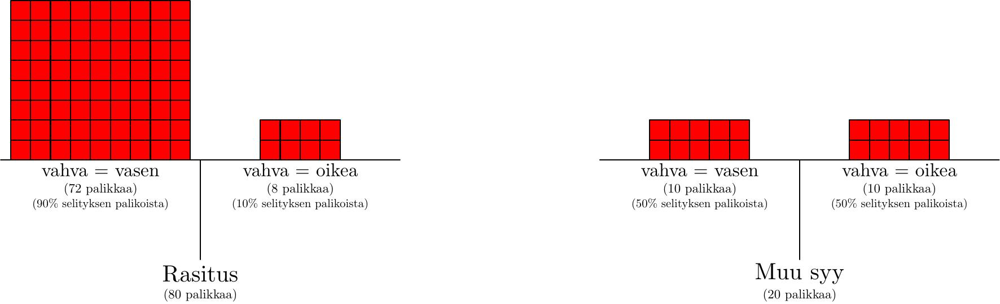
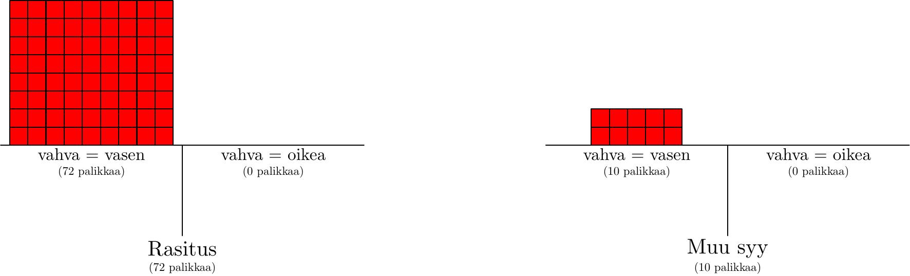
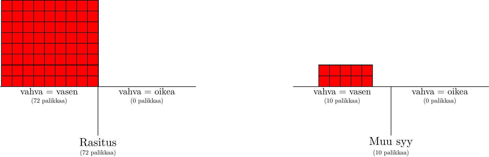
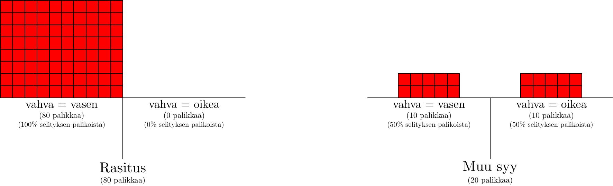

# Uskomusten muutos

Eräänä päivänä käytin toistakymmentä tuntia lukemiseen. Myöhemmin illalla silmääni koski.

Ei, en sano sen *johtuneen* lukemisesta. Kysehän olisi voinut olla ties mistä muusta. Ehkä nukuin jotenkin huonosti toisella kyljellä. Ehkä kyse oli yleisestä väsymyksestä. Ehkä olin hieronut silmiäni varomattomasti. Ehkä kyse oli jostakin ihan muusta.

En pitänyt näitä selityksiä kovin uskottavina, siis kovin *todennäköisinä*. Selitys "jos lukee paljon, niin silmät rasittuvat" vaikutti järkevältä, muut taas kaukaa haetuilta tai istuvan huonosti muuhun informaatioon. Mutta eihän sitä voi tietää.

Vai voiko?

Yleensä ihmisillä toinen heidän silmistään on vahvempi kuin toinen. Uskoisin vahvemman silmän rasittuvan lukiessa enemmän. Toisaalta taas rasituksen tunnetta oli vain toisessa silmässäni -- nimittäin vasemmassa.

Hmm... onkohan niin, että vasen silmä on vahvempi silmäni?

Vahvemman silmän voi selvittää tunnetulla tempulla: Laita yksi sormistasi muutaman sentin päähän nenästäsi. Sulje vuorotellen yksi silmistäsi ja seuraa, näyttääkö sormen sijainti muuttuvan taustaan nähden -- jos kyllä, kyseessä on vahvempi silmä.

Minähän selvitin, ja...

Paitsi ennen kuin mennään asioiden edelle: mitä tämä testi ja sen tulokset edes kertovat?

Uskomukseni koskien silmäni jomotuksen syytä ei ole irrallinen muista uskomuksistani. *Uskomuksilla on seurauksia*.

Jos kyseessä todella on lukemisesta aiheutunut rasitus, niin uskoisin sen vaikuttavan nimenomaan vahvempaan silmääni.

Jos kyseessä on jokin muu syy, niin... ne vaikuttaisivat ihan yhtä lailla minun heikompaan tai vahvempaan silmään.

Joten?

Jos käykin niin, että vahvempi silmäni on *oikea*, niin "silmä on rasittunut lukemisesta" -selitys vaikuttaa huonommalta verrattuna "muu syy" -selitykseen. Miksi muka heikompi silmä olisi rasittunut enemmän?

Jos taas käy niin, että vahvempi silmäni on *vasen*, niin tämä selitys näyttää puolestaan hieman paremmalta. Vahvempi silmä on rasittunut enemmän, juuri kuten odottaisikin.

Tulokset eivät tietenkään *todista* mitään. Ei ole *mahdotonta*, että heikompaa silmää jomottaa. Vastaavasti vaikka vahvempi silmäni olisi vasen, on silti *mahdollista*, että kyseessä on jotakin muuta. Joka tapauksessa testauksen kautta saadaan *informaatiota*. Omien uskomusten tulee muuttua *jonkin verran*. Todennäköisyydet eri selityksille eivät ole ykkösiä ja nollia testauksen jälkeen, mutta ne eivät myöskään ole samat kuin aluksi.

Hyvä? Selvä?

Nyt voin paljastaa, että vahvempi silmäni tosiaan on vasen.

Hurraa, "silmä on rasittunut lukemisesta" -selitys vaikuttaa paremmalta!

Ja... mitä sitten? [Kuinka paljon](/epi/kvantifiointi) tämän oikeasti pitäisi vaikuttaa uskomuksiini? Onko nyt "käytännössä varmaa", että tämä on oikea selitys? Vai onko tämä vain pieni muutos todennäköisyyksiin -- niin pieni, että se on "käytännössä nolla"? Vai jotain tältä väliltä? Tällaisenaan johtopäätös [ei kerro kovin paljoa](/epi/matala_informaatio).

---

Tehdään tarkempi analyysi.

Kuten mainitsin, pidin lukemisselitystä selkeästi parhaimpana. Laitan tälle todennäköisyydeksi... 80%?, (Oikeasti ehkä enemmänkin, mutta pidetään luvut helppoina ja pyöreinä.) Ja siten muut selitykset saavat 20%.

Ja kuten todettiin, nämä eri selitykset *ennustavat eri tuloksia* "kumpi silmä on vahvempi" -testin tuloksille. "Muut selitykset" -kategorian panokset jakautuvat tasan: ei ole mitään [symmetriaa rikkovaa](/epi/symmetrian_rikkominen) syytä, miksi juuri heikompaan (eikä vahvempaan) silmään olisi kohdistunut isku tai muuta. Toisaalta taas "lukeminen rasittaa" laittaa hyvin suuren osan panoksistaan vasemman silmän vahvuudella. Kuinka suuren osan? Eh, vaikea sanoa. Ehkä 90%? Mennään vaikka sillä.

Alla on tilannetta havainnollistava kuva: selitykset ja niiden asettamat panokset testin tuloksille. Kuten aiemmin, yksi palikka vastaa yhtä prosenttia.

Ja miten käy, kun tulokset julkistetaan? Väärälle veikkaukselle asetetut panokset katoavat, ja...

Ja kuten edellisessä tekstissä opittiin, palikoiden vähentyessä käynnistyy deflaatio -- kokonaistodennäköisyyden pitää olla 100 prosenttia. Tällä kertaa deflaatiota tosin tapahtuu vain vähän, jolloin muutos kuvassa ei ole niin merkittävä:

...joka tapauksessa: Aiemmin palikat jakautuivat suhteessa 80 : 20, jolloin todennäköisyydet olivat 80% ja 20%. Nyt palikat jakautuvat suhteessa 72 : 10, jolloin todennäköisyydet ovat... 72/82 ja 10/82. Uusi todennäköisyys lukemisselitykselle on 72/82 eli noin 88% ja muille selityksille 12%.

Joten? Ei ole edelleenkään "käytännössä varmaa", että lukemisselitys on oikea. Silti kyseessä on ihan kohtalainen muutos uskomuksiin: muiden selitysten todennäköisyys melkein puolittui.

---

Tämä koko prosessi vaikuttaa hieman hankalalta. Eikä ole ihan selvää, ovatko tulokset järjen mukaisia. Jos olisin saanut vastaukseksi 88 prosentin sijasta 97% tai 82%, niin olisitko pitänyt tulosta silti järkevänä? Mistä tietää, että nämä muut vastaukset *eivät* ole järkeviä tai oikeita? Tai mistä tiedät, etten ole tehnyt tarkoituksella "laskuvirhettä" ja oikea vastaus on sittenkin 82 prosenttia?

Eli miten tätä kuuluu ajatella?

Esittelen uuden termin *evidenssi* (engl. evidence). Kenties lähin aidosti suomenkielinen sana on "todistusaineisto", mutta koska emme istu oikeussalissa, pitäydyn termissä "evidenssi".

Vahvemman silmän testauksella saadaan informaatiota siitä, mikä on oikea selitys. Tulos "vahvempi silmä on oikea" on *evidenssiä* muiden selitysten puolesta verrattuna lukemis-rasitus-selitykseen. Vastaavasti "vahvempi silmä on vasen" on evidenssiä lukemis-rasitus-selityksen puolesta.

Evidenssien *suuruutta* tai *vahvuutta* voi vertailla ja [kvantifioida](/epi/kvantifiointi). Jos kävisin lääkärissä ja lääkäri onnistuisi diagnosoimaan syyn oireelleni, muuttuisivat uskomukseni hyvin vahvasti diagnoosin suuntaan. Tämäkään ei silti *todista* mitään, todennäköisyys ei edelleenkään ole täysi sata prosenttia -- diagnoosit ja lääkäritkin kun voivat myös olla väärässä -- mutta uskomukseni muuttuisivat paljon enemmän kuin saadessani tietää, kumpi silmistäni on vahvempi.

Mikä on luontevin tapa mitata evidenssin vahvuutta?

Kuvitellaan, että minä ja sinä teemme ennustuksia vaikkapa huomisen säästä. Minä pidän sadetta 30% todennäköisenä, sinä 60%. Seuraavana päivänä sataa. Sinulla selvästikin oli totuudenmukaisemmat uskomukset, tarkalleen kaksi kertaa niin hyvät kuin minulla. Jos taas minä olisin laittanut sateen todennäköisyydeksi 80%, sinä 10%, olisi ero ollut kahdeksankertainen minun puolestani. Jos molemmat olisimme laittaneet todennäköisyydeksi 70%, ei eroa olisi ollut.

Näitä eroja on helpoin hahmottaa *suhteiden* kautta. Ensimmäisessä tapauksessa oikealle vastaukselle laitettujen arvojen suhde oli 1 : 2, toisessa 8 : 1, kolmannessa 1 : 1.

Suhde kertoo sekä sen, kumpi osapuoli oli *parempi* että sen, kuinka *paljon* parempi. Suhde 1 : 2 kertoo sinun olleen kohtalaisesti parempi, 8 : 1 taas minun olleen paljon parempi.

Ja suhteen kannalta oleellista ei ole, kuinka hyvin minä tai sinä olemme ennustaneet vaan se, kuinka hyvin olemme ennustaneet *toiseen verrattuna*.

---

Palataan sitten silmäesimerkkiin. Alussa todennäköisyydet eri selityksille ovat 80% ja 20%, siis 4 : 1. Rasitusselitys laittaa 90% panoksistaan sille, että vahvempi silmä on vasen. "Muu"-selitys laittaa tälle 50% panoksistaan. Suhde on siis 9 : 5.

Pidä mielessä: oleellista on, kuinka *suuren osan* panoksistaan laittaa vaihtoehdolle ja kuinka paljon se on *suhteessa* toiseen (eikä suoraan, kuinka *monta* palikkaa tälle laittaa).

Alla on vielä uudestaan aiempi kuva.

9 : 5 on hieman ikävä suhde käsitellä. Pyöristetään se yksinkertaisuuden vuoksi suhteeksi 10 : 5 eli 2 : 1. Tämä olisi sama kuin jos rasitusselitys laittaisi kaikki panoksensa vasemmalle (ja "muu"-selitys edelleen tasan oikealle ja vasemmalle).

Selvä: Aluksi todennäköisyyksien suhde oli 4 : 1. Testillä saamme 2 : 1 verran evidenssiä rasitusselityksen puolesta. Mikä on uusi, päivitetty arvio?

8 : 1.

Vastauksen todella saa *vain kertomalla suhteet keskenään* -- niin tässä tapauksessa kuin yleisesti.

Miksi? Tämä on oikeasta näkökulmasta katsottuna tavallaan itsestäänselvyys, mutta tämän oikean näkökulman löytäminen ei välttämättä ole ilmeistä. Yritän selittää:

Alussa kutakin oikealla olevaa "muu"-selityksen palikkaa kohden vasemmalta "rasitus"-selitykseltä löytyy 4 palikkaa. Vasen puoli on siis neljä kertaa niin "painava" kuin oikea puoli (kun ajatellaan kullakin palikalla olevan sama paino). Sitten testaamme. Palikoita katoaa. Vasemmalle puolelle jää *suhteessa* kaksinkertainen määrä palikoita, jolloin siitä tulee suhteessa vielä kaksi kertaa aiempaa painavampi oikeaan nähden. Yhteensä tämä vastaa kahdeksankertaista eroa.

Vielä kerran, oleellista ei ole kuinka painava puoli on *absoluuttisesti* vaan *suhteessa toiseen puoleen*.

Näillä työkaluilla koko prosessin voi tiivistää muutamaan virkkeeseen:

"Silmääni koskee. Keksin muutamia selityksiä, mutta lukemisen aiheuttama rasitus vaikuttaa ilmeisimmältä syyltä -- annan sille vaikka 80% todennäköisyyden. Hetkinen, voin testata asiaa. Lukemisselitys antaa huomattavasti eri ennustuksia koskien vasemman silmän dominanttiutta kuin muut selitykset: lukemisselitys vihjaa hyvin vahvasti vasemman silmän olevan vahvempi, muut selitykset taas antavat 50%-50% -ennustuksen. Testataan. Tadaa, vasen silmä todella oli vahvempi! Siis alunperin todennäköisyydet olivat 4 : 1, sain evidenssiä suunnilleen 2 : 1 verran, joten uudet todennäköisyydet ovat noin 8 : 1, eli siis 8/9 ja 1/9. Tämä tarkoittaa noin 89% todennäköisyyttä rasitusselitykselle."

(Tämä vastaa ajatusprosessia, joka minulla todellisuudessa tapahtui asiaa miettiessäni.)

Tai vielä helpompi temppu: jos epätodennäköistä vaihtoehtoa vastaan tulee 2 : 1 -verran evidenssiä, sen todennäköisyys suunnilleen puolittuu. (Tämä on hyvä arvio ääripäässä, kun todennäköisyys on lähellä nollaa, mutta huono lähempänä 50 prosenttia.) Muiden hypoteesien todennäköisyys tippuu 20 prosentista suunnilleen 10 prosenttiin, ja rasitusselityksen uusi todennäköisyys on siten noin 90 prosenttia.

Pointtini on, että tämä todella on "helppoa, kun sen osaa": prosessi itsessään on hyvin yksinkertainen, vaikka sen oppiminen tai selittäminen ei olekaan ihan niin yksinkertaista. Idea "uskomuksesi muuttuvat, kun saat uutta informaatiota" ei tunnu minusta kovin mutkikkaalta tai edistyneeltä (joku voisi jopa kutsua sitä itsestäänselvyydeksi). Todennäköisyyksien kautta tätä konseptia saadaan kuvailtua hieman tarkemmin ja syvemmin.
