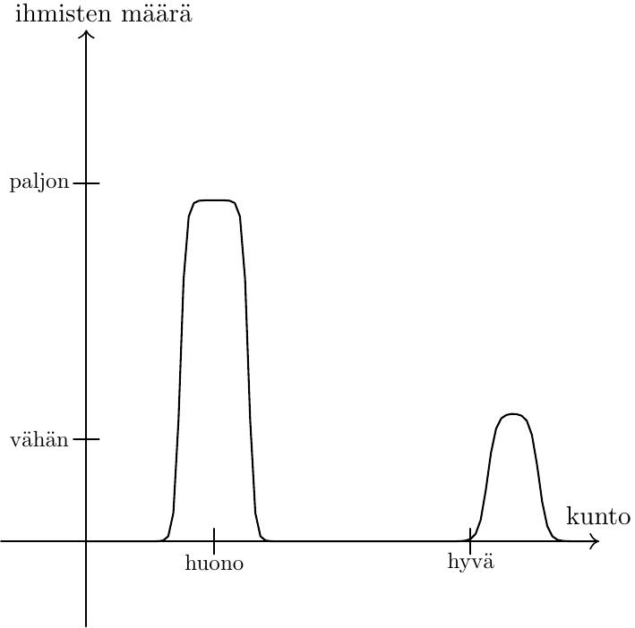
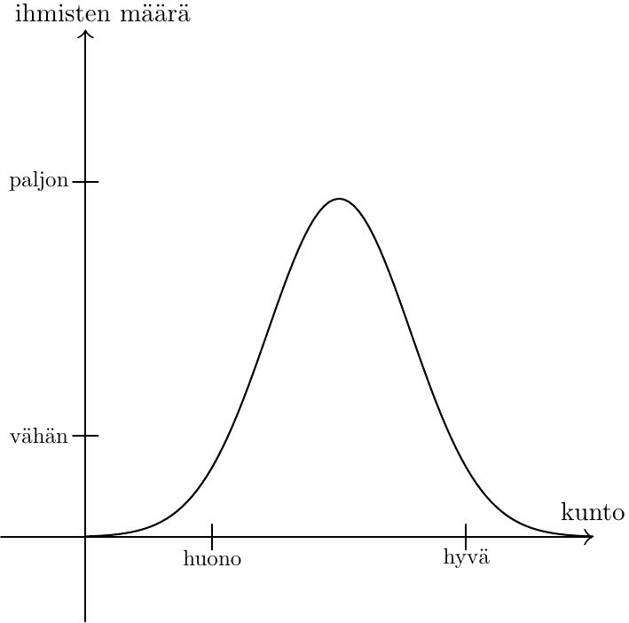

# Binääriset kategoriat ja jakaumat

Kerran kuulin jonkun sanovan "Nykyään ihmisillä on huono kunto, paitsi ne, joilla on hyvä kunto, ovat *tosi* hyvässä kunnossa".

Pysähdyin miettimään. Kuva, jonka kommentti maalaa, näyttää tällaiselta:

Hmm, erikoista. Nimittäin yleensä kun olen nähnyt oikeaan dataan perustuvia jakaumia, niin ne ovat pikemminkin tämänmuotoisia:

Binäärinen jaottelu ei ole oikea näkökulma aiheeseen. Ihmiset eivät asetu siististi hyvä- ja huonokuntoisiin, vaan on myös OK-kuntoisia, ääripäitä ja kaikkea siltä väliltä. Ääripäitä lähestyttäessä ihmisten määrä tietysti vähenee.

Vasta kun karkea kuva jatkuvasta jakaumasta on kunnossa, voidaan lähteä esittämään väitteitä kuten "ihmisten kunto on keskimäärin heikentynyt" tai "hyväkuntoisimman 1% ihmisistä kunto on noussut".

Joku voisi sanoa, että tämä on tietysti mitä väitteen esittäjä tarkoitti -- että tietenkään hän ei oikeasti tarkoittanut, että on ne huonokuntoiset ihmiset ja sitten ne hyväkuntoiset. Pidän tätä kuitenkin [liian kohteliaana tulkintana](/epi/kohteliaat_tulkinnat) väitteelle. Väitän, että ihmiset sortuvat tällaisiin virheisiin ja etteivät he automaattisesti mieti asioita jakaumina.

Miksi uskon näin? Tässä on joitain syitä:

- Omien ajatusteni ja muiden ihmisten puheiden reflektointi paljastaa, että käytännössä asioita tulee liian usein mietittyä binääristen kategorioiden kautta.
- Ihmiskunnalla ei ole aina ollut tilastotieteen oppeja, vaan ne on jouduttu kehittämään. Jakaumien käsittely on opittu taito, ei jotakin, mikä ihmisillä on luonnostaan tai minkä evoluutio on meihin rakentanut.
- Tilastoihin liittyy muutama [tunnettu](https://en.wikipedia.org/wiki/Insensitivity_to_sample_size) "[paradoksi](https://en.wikipedia.org/wiki/Berkson%27s_paradox)" ja [ajatusvirhe](https://en.wikipedia.org/wiki/Neglect_of_probability).

Tässä on pari syytä sille, mistä virheet johtuvat.

Ensinnäkin jakaumien käsittely on kognitiivisesti raskaampaa. On niin helppoa ajatella, että on ne hyväkuntoiset ihmiset ja sitten on ne huonokuntoiset ihmiset. Vastaavasti on helppoa miettiä parhaimpia ja huonoimpia -- he [tulevat helpoiten mieleen](https://en.wikipedia.org/wiki/Availability_heuristic). Keskiarvojen, varianssin ja jakaumien muodon käsittely on haastavampaa.

Toiseksi saamassamme informaatiossa on vahvaa suodatusta: määrään suhteutettuna kuulemme paljon todennäköisemmin todella hyväkuntoisista kuin kunnoltaan keskiverrommista. Kilpailuissa etsitään parhaita ja heistä on kiinnostavampaa puhua. Seuraus: on ne hyväkuntoiset ihmiset joista aina puhutaan, ja sitten on me tavalliset tallaajat. Muistimme, ihmisten puheiden ja median tarjoama data ei siis ole edustavaa.

Pyrin itse olemaan yksi heistä, jotka käyttävät jakaumia sopivasti.
